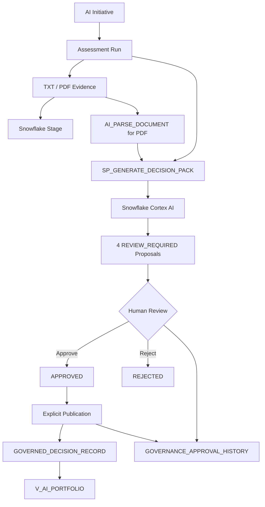

# SOLIFAN ReadinessOps

**Human-governed AI value control on Snowflake**

ReadinessOps turns assessment context and uploaded evidence into a four-section Decision Pack for accountable review. Snowflake Cortex analyzes the evidence, but no AI draft becomes a governed record until a person approves it and explicitly publishes it.

## Why It Matters

Enterprise AI initiatives need more than a readiness score. Teams must preserve the path from evidence to an accountable investment decision:

```text
AI Initiative
→ Assessment + Evidence
→ Governance / Value / Model Routing / Portfolio drafts
→ Human Decision
→ Governed Decision Record
→ Portfolio view + Audit history
```

ReadinessOps demonstrates that operating lifecycle inside Snowflake while preserving the existing Gap, Risk, and Action governance workflow.

## Finalist Value Control Plane

The finalist build adds five connected workspaces:

1. **Initiative** — create or link an AI Initiative to an Assessment Run
2. **Evidence** — upload TXT or PDF evidence, retain the original file in a Snowflake stage, and store validated text and metadata
3. **Decision Pack** — generate exactly four evidence-grounded AI drafts: Governance, Value, Model Routing, and Portfolio
4. **Published** — inspect only human-approved, explicitly published Governed Decision Records
5. **Portfolio** — compare initiatives by stage, governance status, value assessment, recommendation, and priority

The Decision Pack workspace also exposes a governed five-step execution trace.
Human decisions and publication events remain visible in the existing **Audit trail** workspace.

## Control Boundary

| Role | Authority |
|---|---|
| Cortex AI | Parses supplied evidence and proposes Decision Pack sections or legacy Gap, Risk, and Action drafts |
| Human reviewer | Approves or rejects each proposal and records the decision rationale |
| Publication procedure | Writes only approved proposals to governed tables and records publication history |
| Dashboard | Separates drafts, approved items, published records, portfolio views, and audit history |

```text
AI Draft → REVIEW_REQUIRED → Human APPROVE / REJECT → Explicit PUBLISH → Governed Record
```

The model cannot approve its own output and cannot publish directly from generation.

## Product Walkthrough

### 1. Retained TXT/PDF Evidence

The Value Control Plane retains original TXT/PDF files, parses PDF content with Cortex document intelligence, and records validation metadata.


### 2. Governed Decision Pack Execution

The generated Governance, Value, Model Routing, and Portfolio sections remain AI drafts until a person reviews each section. Five persisted Run Steps make input validation, context assembly, Cortex generation, output validation, and draft persistence inspectable without adding model calls.


### 3. Human Decision and Publication Audit

Approval, rejection, and publication are separate state transitions with actor, timestamp, proposal, and comment traceability.


## Architecture



The existing governed path remains intact:

```text
Question + Answer + Evidence + Rule Context
→ Gap / Risk / Action drafts
→ Human review
→ READINESS_GAPS / RECOMMENDED_ACTIONS
```

Approved Risks continue to publish to `READINESS_GAPS` with a `[RISK]` title prefix. The finalist migration extends `SP_PUBLISH_AGENT_RUN` additively; the existing Gap, Risk, and Action mappings are preserved.

See [docs/architecture.md](docs/architecture.md) for the detailed design.

## Core Snowflake Objects

| Object | Purpose |
|---|---|
| `AI_INITIATIVE` | Initiative name, owner, stage, and lifecycle status |
| `ASSESSMENT_RUNS.INITIATIVE_ID` | Links an Assessment Run to an initiative |
| `EVIDENCE_ITEMS` | Validated evidence text, hashes, source metadata, parser metadata, and stage path |
| `READINESSOPS_EVIDENCE_STAGE` | Retains original TXT and PDF files |
| `GOVERNANCE_AGENT_RUN` | Review execution, model, instruction, status, timestamps, fingerprint, and summary |
| `GOVERNANCE_AGENT_RUN_STEP` | Ordered execution steps, status, timing, safe summaries, and errors for each Decision Pack run |
| `GOVERNANCE_AGENT_PROPOSAL` | Legacy and Decision Pack drafts with review and publication states |
| `GOVERNANCE_AGENT_PROPOSAL_SOURCE` | Proposal-to-evidence traceability |
| `GOVERNANCE_APPROVAL_HISTORY` | Approval, rejection, and publication events |
| `GOVERNED_DECISION_RECORD` | Published Governance, Value, Routing, and Portfolio decisions |
| `SP_GENERATE_DECISION_PACK` | Generates and validates the four-section Decision Pack |
| `SP_EDIT_AGENT_PROPOSAL` | Saves reviewer edits before a decision |
| `SP_PUBLISH_AGENT_RUN` | Publishes approved legacy and Decision Pack proposals idempotently |
| `V_AI_PORTFOLIO` | Portfolio presentation across AI initiatives |

## Snowflake Features Used

| Feature | Usage |
|---|---|
| Snowflake Cortex AI | `AI_COMPLETE()` with a strict JSON response schema for Decision Pack generation |
| Cortex document intelligence | `AI_PARSE_DOCUMENT` for PDF evidence extraction |
| Streamlit in Snowflake | Initiative, evidence, review, publication, portfolio, and audit workspaces |
| SQL Scripting | Validation, state transitions, controlled writes, and exception handling |
| Governed execution trace | Five persisted run steps without additional model calls |
| Semi-structured data | `VARIANT`, `FLATTEN`, `TRY_PARSE_JSON`, and strict output-contract checks |
| Internal stages | Original-file retention for uploaded evidence |
| Snowflake identity and timestamps | Reviewer, uploader, and publisher attribution |
| Hashing | Duplicate detection and input traceability |

## Deployment

### Prerequisites

- Snowflake account with Cortex AI and `AI_PARSE_DOCUMENT` available
- Access to the configured Cortex model (`mistral-large2` in this demonstration)
- Snowflake CLI connection
- Warehouse and privileges to create tables, views, procedures, stages, and Streamlit apps

### Deploy the data model

Deploy the existing governed path first, then the finalist migration:

```text
sql/01_setup.sql
sql/02_seed_data.sql
sql/03_views.sql
sql/10_governance_model.sql
sql/11_governance_review_procedure.sql
sql/12_review_procedure.sql
sql/13_publish_procedure.sql
sql/14_dashboard_view_update.sql
sql/20_foundation_slice_1.sql
sql/21_revision_lifecycle_foundation.sql
sql/24_revision_1_migration.sql
sql/25_revision_draft_procedures.sql
sql/27_evidence_binary_storage.sql
sql/29_register_revision_evidence_procedure.sql
sql/30_revision_publication_procedure.sql
sql/32_create_revision_procedure.sql
```

`sql/20_foundation_slice_1.sql` is idempotent and adds the Value Control Plane objects while preserving existing Gap, Risk, and Action behavior.

Run the read-only Revision checks after deployment:

```text
sql/22_revision_lifecycle_validation.sql
sql/26_revision_draft_validation.sql
sql/28_evidence_binary_storage_validation.sql
sql/31_revision_release_validation.sql
```

The Revision lifecycle keeps the published Current State immutable, creates a
separate Draft Run with inherited answers and Evidence, records frozen
before/after comparisons, and advances Current State only after explicit
publication. The Value Control Plane **Revisions** section exposes the timeline,
Evidence lineage, change types, reasons, source Evidence, and before/after
payloads without requiring SQL access.

### Deploy the Streamlit app

From PowerShell:

```powershell
powershell.exe -NoProfile -ExecutionPolicy Bypass `
  -File '.\scripts\deploy_production_dashboard.ps1' `
  -ConnectionName '<SNOWFLAKE_CLI_CONNECTION>' `
  -Database 'READINESSOPS_VALIDATION' `
  -Schema 'APP' `
  -ViewerRole 'READINESSOPS_EVALUATOR'
```

The script uploads:

- `app/environment.yml`
- `app/value_control_plane.py`
- `app/streamlit_app.py`

It then recreates `READINESSOPS_VALIDATION.APP.READINESSOPS_DASHBOARD`. The Streamlit runtime is pinned to `1.35.0`.
When `ViewerRole` is supplied, the script restores the required Database,
Schema, and Streamlit `USAGE` grants after `CREATE OR REPLACE`.

## Finalist E2E Flow

Use an isolated Assessment Run such as `RUN_FINALIST_E2E_001`; do not modify `RUN_001`.

1. Open **Value Control Plane**.
2. Create or link an AI Initiative.
3. Upload TXT and PDF evidence.
4. Confirm the original files are retained in `READINESSOPS_EVIDENCE_STAGE` and PDF text is parsed.
5. Generate the four-section Decision Pack.
6. Inspect and approve or reject every section.
7. Confirm publication, then publish approved sections.
8. Inspect **Published**, **Portfolio**, and **Audit trail**.

See [docs/demo-guide.md](docs/demo-guide.md) for the presentation sequence.

## Verified Finalist Lifecycle

The isolated E2E run validated:

- one linked AI Initiative
- TXT and PDF upload with original-file retention
- PDF parsing through Cortex document intelligence
- strict four-section Decision Pack generation
- four `REVIEW_REQUIRED` proposals
- four human approvals followed by explicit publication
- four Governed Decision Records
- eight approval/publication audit events
- portfolio recommendation `PROCEED` with priority `85` in the test data
- zero proposal leakage into `RUN_001`
- preserved Gap, Risk, and Action publication behavior
- successful production Streamlit deployment

See [docs/hackathon/FINAL_TEST_REPORT.md](docs/hackathon/FINAL_TEST_REPORT.md).

## Repository Structure

```text
solifan-readinessops/
├── README.md
├── app/
│   ├── streamlit_app.py
│   ├── value_control_plane.py
│   ├── environment.yml
│   └── README.md
├── assets/screenshots/
├── docs/
│   ├── architecture.md
│   ├── demo-guide.md
│   ├── hackathon-submission.md
│   └── hackathon/
├── prompts/
│   ├── readiness_agent_prompt.md
│   └── decision_pack_prompt.md
├── scripts/
│   └── deploy_production_dashboard.ps1
└── sql/
    ├── 01_setup.sql ... 20_foundation_slice_1.sql
    ├── 21_revision_lifecycle_foundation.sql ... 30_revision_publication_procedure.sql
    ├── 31_revision_release_validation.sql
    └── 32_create_revision_procedure.sql
```

## Current Limitations

- The demonstration data is synthetic and intentionally small.
- The configured generation model is fixed in the current procedure.
- Approved legacy Risks are normalized into `READINESS_GAPS`; a dedicated Risk register is not included.
- Audit history is persistent and application-recorded, but the repository does not claim storage-level immutability.
- Production use requires environment-specific RBAC, access policies, retention controls, monitoring, and change management.
- The current deliverable is a deployed Streamlit in Snowflake solution, not yet a Snowflake Native App package.

## Public-Safe Disclaimer

This repository contains synthetic demonstration data only. It does not contain customer assessments, credentials, private account identifiers, or proprietary client information.

## Security

Do not report vulnerabilities in a public issue. Follow [SECURITY.md](SECURITY.md).

## Copyright and Use

Copyright © 2026 SOLIFAN LLC. All rights reserved.

This repository is published solely for hackathon evaluation and technical demonstration. No license is granted to use, copy, modify, distribute, sublicense, commercialize, or create derivative works from the source code, prompts, schemas, documentation, screenshots, or other materials without prior written permission from SOLIFAN LLC.
