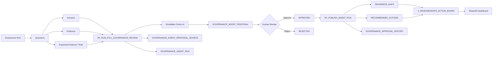

# SOLIFAN ReadinessOps

**Human-governed AI readiness management on Snowflake**

ReadinessOps turns assessment answers and evidence into governed Gap, Risk, and Action proposals. Snowflake Cortex generates the drafts, but no AI output becomes a canonical governance record until a human reviewer approves and publishes it.

## Governance Flow

```text
Question + Answer + Evidence + Rule
                ↓
       Cortex AI governance review
                ↓
       Gap / Risk / Action drafts
                ↓
        Human approve or reject
                ↓
       Controlled publication
                ↓
 Dashboard + audit-ready history
```

## What It Demonstrates

- Evidence-grounded governance review inside Snowflake
- Gap, Risk, and Action proposal generation
- Draft isolation with `REVIEW_REQUIRED` status
- Human approval and rejection with comments
- Controlled publication to canonical tables
- Source traceability from every proposal back to assessment context
- Immutable approval and publication history
- Assessment and agent-run history for repeatable governance operations
- Streamlit in Snowflake workspace for review and publication

## Screenshots

### Governance Review Summary

The workspace shows evidence status, the latest agent run, proposal counts, and the human-review queue.


### Natural-Language AI Review Setup

Reviewers can add a business-priority instruction before Cortex generates a new set of evidence-grounded draft proposals.


### Human Decision and Publication Audit

Every approval, rejection, and publication remains attributable to an actor, timestamp, proposal, and state transition.


## Architecture



See [docs/architecture.md](docs/architecture.md) for the detailed design.

## Core Snowflake Objects

| Object | Purpose |
|---|---|
| `GOVERNANCE_AGENT_RUN` | Stores each governance review execution, instruction, model, status, and result |
| `GOVERNANCE_AGENT_PROPOSAL` | Stores Gap, Risk, and Action drafts and their review state |
| `GOVERNANCE_AGENT_PROPOSAL_SOURCE` | Links proposals to Question, Answer, Evidence, and Rule context |
| `GOVERNANCE_APPROVAL_HISTORY` | Stores review and publication events |
| `SP_RUN_FULL_GOVERNANCE_REVIEW` | Generates evidence-grounded draft proposals |
| `SP_REVIEW_AGENT_PROPOSAL` | Approves or rejects one proposal with a comment |
| `SP_PUBLISH_AGENT_RUN` | Publishes only approved proposals |
| `V_READINESSOPS_ACTION_BOARD` | Presents canonical dashboard records and excludes legacy direct-write output |

## Snowflake Features Used

| Feature | Usage |
|---|---|
| Cortex AI | `SNOWFLAKE.CORTEX.COMPLETE()` for structured governance analysis |
| SQL Scripting | Stored procedures, validation, exception handling, and controlled writes |
| Semi-structured data | `VARIANT`, `FLATTEN`, and `TRY_PARSE_JSON` |
| Streamlit in Snowflake | Review, approve, reject, publish, and inspect run history |
| Views | Canonical presentation layer for dashboard output |
| Hashing | Input fingerprint for run traceability |

## Quickstart

### Prerequisites

- Snowflake account with Cortex AI enabled
- Access to the `mistral-large2` model
- A warehouse available to the application
- Privileges to create tables, views, procedures, stages, and Streamlit apps

### Deploy

Run the SQL files in this order:

```text
sql/01_setup.sql
sql/02_seed_data.sql
sql/03_views.sql
sql/04_stored_procedure.sql
sql/10_governance_model.sql
sql/11_governance_review_procedure.sql
sql/12_review_procedure.sql
sql/13_publish_procedure.sql
sql/14_dashboard_view_update.sql
sql/15_validation_tests.sql
```

The `04` procedure is retained as the earlier direct-write prototype. The governed workspace uses the `10`–`15` implementation.

### Run a Governed Review

```sql
CALL SP_RUN_FULL_GOVERNANCE_REVIEW(
  'RUN_001',
  'Prioritize governance issues that could block executive approval within the next 90 days. Do not propose any gap, risk, or action that is not supported by the supplied assessment evidence.'
);
```

Review proposals through Streamlit or call:

```sql
CALL SP_REVIEW_AGENT_PROPOSAL(
  '<PROPOSAL_ID>',
  'APPROVE',
  'Reviewed against supplied evidence.'
);
```

Publish approved proposals:

```sql
CALL SP_PUBLISH_AGENT_RUN('<AGENT_RUN_ID>');
```

## Verified Governance Lifecycle

Validated in `READINESSOPS_VALIDATION.APP`:

- Full review completed successfully
- Latest demonstrated review generated 5 Gaps, 2 Risks, and 5 Actions
- Gap approval and publication succeeded
- Action approval and publication succeeded
- Risk rejection succeeded
- Rejected proposals were not written to canonical tables
- Review comments remained attached to the correct proposal type
- Gap and Action each produced approval and publication history records
- Re-running publication did not create duplicate canonical records
- The dashboard view excludes legacy `AR_%` direct-write records

## Repository Structure

```text
solifan-readinessops/
├── README.md
├── app/
│   ├── streamlit_app.py
│   ├── environment.yml
│   └── README.md
├── assets/
│   └── screenshots/
│       ├── app_ss_01.png
│       ├── app_ss_02.png
│       └── app_ss_03.png
├── docs/
│   ├── GOVERNANCE_AGENT_CURRENT_STATE.md
│   ├── architecture.md
│   ├── demo-guide.md
│   ├── hackathon-submission.md
│   └── implementation-notes.md
├── prompts/
│   └── readiness_agent_prompt.md
└── sql/
    ├── 01_setup.sql
    ├── 02_seed_data.sql
    ├── 03_views.sql
    ├── 04_stored_procedure.sql
    ├── 05_run_agent.sql
    ├── 06_verify_agent_run.sql
    ├── 07_cleanup_generated_data.sql
    ├── 10_governance_model.sql
    ├── 11_governance_review_procedure.sql
    ├── 12_review_procedure.sql
    ├── 13_publish_procedure.sql
    ├── 14_dashboard_view_update.sql
    └── 15_validation_tests.sql
```

## Relationship to SOLIFAN CCoE Readiness Studio

ReadinessOps demonstrates the governed agent workflow behind the broader SOLIFAN CCoE Readiness Studio:

```text
Question → Evidence → Gap → Risk → Action
```

The purpose is not a one-time diagnosis. It is to support repeatable Enterprise AI Governance through assessment history, evidence traceability, human decisions, controlled publication, and operational follow-through.

## Current Limitations

- Model selection is currently fixed to `mistral-large2`
- The sample assessment is intentionally small and synthetic
- Risk proposals are reviewed as first-class drafts; approved canonical publication follows the current governance model implementation
- No automatic schedule or event trigger is included
- Production deployments require role design, access policies, and environment-specific controls

## Public-Safe Disclaimer

This repository contains only synthetic demonstration data. It does not contain real organizational assessments, credentials, account identifiers, or proprietary customer information.

## Copyright and Use

Copyright © 2026 SOLIFAN LLC. All rights reserved.

This repository is published solely for hackathon evaluation and technical demonstration. No license is granted to use, copy, modify, distribute, sublicense, commercialize, or create derivative works from the source code, prompts, schemas, documentation, screenshots, or other materials without prior written permission from SOLIFAN LLC.