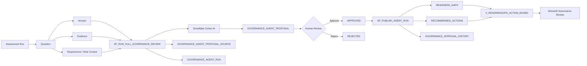

# SOLIFAN ReadinessOps

**Human-governed AI readiness management on Snowflake**

ReadinessOps turns assessment answers and evidence into reviewable Gap, Risk, and Action proposals. Snowflake Cortex generates evidence-grounded drafts, but no AI output becomes a governed record until a human reviewer makes a decision and explicitly publishes the approved proposal.

## Why It Matters

A readiness score identifies a condition. Governance work must also preserve:

```text
Question → Answer → Evidence → Gap → Risk → Action → Human Decision → Published Record
```

ReadinessOps demonstrates that operating lifecycle inside Snowflake.

## Governance Flow

```text
Assessment context
        ↓
Natural-language review priority
        ↓
Cortex AI proposal generation
        ↓
REVIEW_REQUIRED drafts
        ↓
Human approve or reject
        ↓
Controlled publication
        ↓
Governed records + decision history
```

## Control Boundary

| Role | Authority |
|---|---|
| AI | Analyzes supplied Question, Answer, Evidence, and Rule Context; proposes Gap, Risk, and Action drafts |
| Human reviewer | Approves or rejects individual proposals and records the decision rationale |
| Publication procedure | Writes only approved proposals to governed tables and records publication history |
| Dashboard | Shows governed records separately from unresolved drafts |

Natural-language input is intentionally limited to two accountable points:

1. **Review priority:** an optional business instruction before proposal generation
2. **Decision rationale:** a reviewer comment when approving or rejecting a proposal

## Product Walkthrough

### 1. Governance Review Summary

The workspace shows the latest completed review, proposal counts, evidence requiring attention, and the human-review queue.


### 2. Natural-Language AI Review Setup

A reviewer can add a business priority or time horizon. The additional instruction supplements the fixed evidence-grounding requirement; it cannot authorize publication.


### 3. Human Decision and Publication Audit

Approval, rejection, and publication are separate state transitions with actor, timestamp, proposal, and comment traceability.


## Architecture



### Canonical Risk Handling

The demonstration schema has no dedicated canonical Risk table. Risk is a first-class proposal type during generation and human review. When an approved Risk is published, `SP_PUBLISH_AGENT_RUN` stores it in `READINESS_GAPS` with a `[RISK]` title prefix and preserves the source proposal type through traceability. This normalization is explicit and documented rather than hidden.

See [docs/architecture.md](docs/architecture.md) for the detailed design.

## Core Snowflake Objects

| Object | Purpose |
|---|---|
| `GOVERNANCE_AGENT_RUN` | Review execution, model, instruction, status, timestamps, input fingerprint, and result summary |
| `GOVERNANCE_AGENT_PROPOSAL` | Gap, Risk, and Action drafts with review and publication states |
| `GOVERNANCE_AGENT_PROPOSAL_SOURCE` | Source traceability to Question, Answer, Evidence, and Rule Context |
| `GOVERNANCE_APPROVAL_HISTORY` | Application-recorded approval, rejection, and publication events |
| `SP_RUN_FULL_GOVERNANCE_REVIEW` | Generates evidence-grounded draft proposals |
| `SP_REVIEW_AGENT_PROPOSAL` | Approves or rejects one proposal with an optional comment |
| `SP_PUBLISH_AGENT_RUN` | Publishes approved proposals and prevents duplicate canonical writes |
| `READINESS_GAPS` | Governed Gap records and normalized Risk records |
| `RECOMMENDED_ACTIONS` | Governed Action records |
| `V_READINESSOPS_ACTION_BOARD` | Canonical presentation layer excluding legacy direct-write output |

## Snowflake Features Used

| Feature | Usage |
|---|---|
| Snowflake Cortex AI | `SNOWFLAKE.CORTEX.COMPLETE()` for structured governance analysis |
| SQL Scripting | Proposal generation, review state transitions, controlled writes, and exception handling |
| Semi-structured data | `VARIANT`, `FLATTEN`, `TRY_PARSE_JSON`, and defensive type normalization |
| Streamlit in Snowflake | Review setup, issue-based review, approval, rejection, publication, and audit inspection |
| Views | Governed presentation layer |
| Snowflake identity and timestamps | Reviewer and publication attribution |
| Hashing | Input fingerprint for run traceability |

## Current Governed Deployment

### Prerequisites

- Snowflake account with Cortex AI enabled
- Access to the configured model (`mistral-large2` in this demonstration)
- Snowflake CLI connection
- Warehouse and privileges to create tables, views, procedures, stages, and Streamlit apps

### Deploy the governed data model

Run the current governed path in this order:

```text
sql/01_setup.sql
sql/02_seed_data.sql
sql/03_views.sql
sql/10_governance_model.sql
sql/11_governance_review_procedure.sql
sql/12_review_procedure.sql
sql/13_publish_procedure.sql
sql/14_dashboard_view_update.sql
```

Then run the validation files:

```text
sql/15_validation_tests.sql
sql/18_hackathon_final_validation.sql
```

Files `04`–`07` are retained as the earlier direct-write prototype and historical validation utilities. They are not the current governed path.

### Deploy the Streamlit app

From PowerShell:

```powershell
.\scripts\deploy_production_dashboard.ps1 `
  -ConnectionName "<SNOWFLAKE_CLI_CONNECTION>" `
  -Database "READINESSOPS_VALIDATION" `
  -Schema "APP" `
  -Warehouse "READINESSOPS_WH"
```

The script uploads `app/streamlit_app.py` to a dedicated stage and recreates the configured Streamlit object.

### Run a governed review

In the app, open **Review setup**, add an optional business instruction, and select **Generate AI draft proposals**.

SQL equivalent:

```sql
CALL SP_RUN_FULL_GOVERNANCE_REVIEW(
  'RUN_001',
  'Prioritize governance issues that could block executive approval within the next 90 days. Do not propose any gap, risk, or action that is not supported by the supplied assessment evidence.'
);
```

Approve or reject a proposal:

```sql
CALL SP_REVIEW_AGENT_PROPOSAL(
  '<PROPOSAL_ID>',
  'APPROVE',
  'Reviewed against the supplied evidence and current governance requirement.'
);
```

Publish approved proposals:

```sql
CALL SP_PUBLISH_AGENT_RUN('<AGENT_RUN_ID>');
```

## Verified Governance Lifecycle

The implementation has been exercised through the following lifecycle:

- Cortex completed a full review and returned 5 Gap, 2 Risk, and 5 Action drafts
- Every generated proposal entered `REVIEW_REQUIRED`
- Gap and Action approvals were written to decision history
- Risk rejection remained outside governed records
- Approved proposals remained unpublished until the explicit publication step
- Published Gap and Action records retained source proposal and agent-run identifiers
- Approval and publication events were visible in the Audit trail
- Re-running publication did not create duplicate governed records
- Visible table numbering starts at 1
- Empty publication state provides a direct **Back to review queue** action
- Production `READINESSOPS_DASHBOARD` was deployed and verified from the Git-tracked source

See [docs/hackathon/FINAL_TEST_REPORT.md](docs/hackathon/FINAL_TEST_REPORT.md).

## Repository Structure

```text
solifan-readinessops/
├── README.md
├── SECURITY.md
├── app/
│   ├── streamlit_app.py
│   ├── environment.yml
│   └── README.md
├── assets/
│   └── screenshots/
├── docs/
│   ├── GOVERNANCE_AGENT_CURRENT_STATE.md
│   ├── architecture.md
│   ├── demo-guide.md
│   ├── hackathon-submission.md
│   ├── implementation-notes.md
│   └── hackathon/
│       ├── ARCHITECTURE.md
│       ├── DEMO_GUIDE_JA.md
│       ├── FINAL_TEST_REPORT.md
│       └── SUBMISSION_DESCRIPTION_JA.md
├── prompts/
│   └── readiness_agent_prompt.md
├── scripts/
│   ├── deploy_production_dashboard.ps1
│   ├── rollback_production_dashboard.ps1
│   └── cleanup_hackathon_apps.ps1
└── sql/
    ├── 01_setup.sql
    ├── 02_seed_data.sql
    ├── 03_views.sql
    ├── 04_stored_procedure.sql
    ├── 05_run_agent.sql
    ├── 06_verify_agent_run.sql
    ├── 07_cleanup_generated_data.sql
    ├── 10_governance_model.sql
    ├── 11_governance_review_procedure.sql
    ├── 12_review_procedure.sql
    ├── 13_publish_procedure.sql
    ├── 14_dashboard_view_update.sql
    ├── 15_validation_tests.sql
    └── 18_hackathon_final_validation.sql
```

## Relationship to SOLIFAN CCoE Readiness Studio

ReadinessOps demonstrates the governed-agent workflow behind the broader SOLIFAN CCoE Readiness Studio:

```text
Question → Evidence → Gap → Risk → Action
```

The product direction is not a one-time diagnosis. It is repeatable Enterprise AI Governance through assessment history, evidence traceability, accountable decisions, controlled publication, and operational follow-through.

## Current Limitations

- Model selection is fixed to `mistral-large2` in the current procedure
- The demonstration assessment is intentionally small and synthetic
- Approved Risks are normalized into `READINESS_GAPS`; a dedicated canonical Risk table is not yet implemented
- Audit history is persistent and application-recorded, but the repository does not claim storage-level immutability
- No scheduler or event trigger is included
- The sample model resolves one effective answer and one latest evidence item per Question
- Production use requires environment-specific RBAC, access policies, data-retention controls, monitoring, and change management

## Public-Safe Disclaimer

This repository contains synthetic demonstration data only. It does not contain customer assessments, credentials, private account identifiers, or proprietary client information.

## Security

Do not report vulnerabilities in a public issue. Follow [SECURITY.md](SECURITY.md).

## Copyright and Use

Copyright © 2026 SOLIFAN LLC. All rights reserved.

This repository is published solely for hackathon evaluation and technical demonstration. No license is granted to use, copy, modify, distribute, sublicense, commercialize, or create derivative works from the source code, prompts, schemas, documentation, screenshots, or other materials without prior written permission from SOLIFAN LLC.
