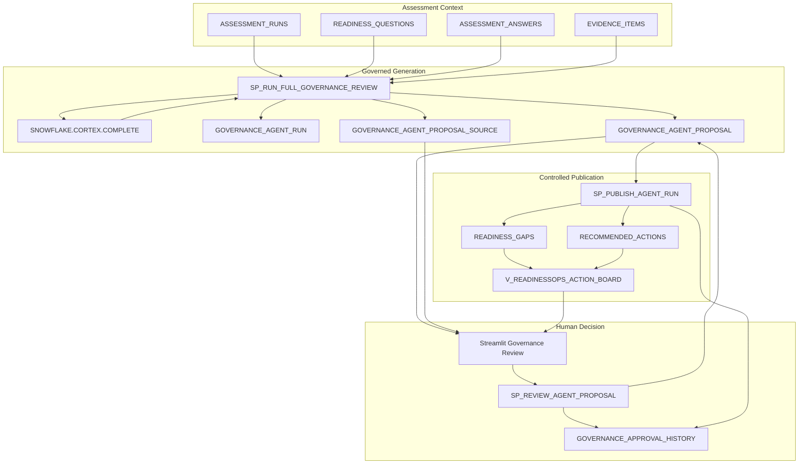
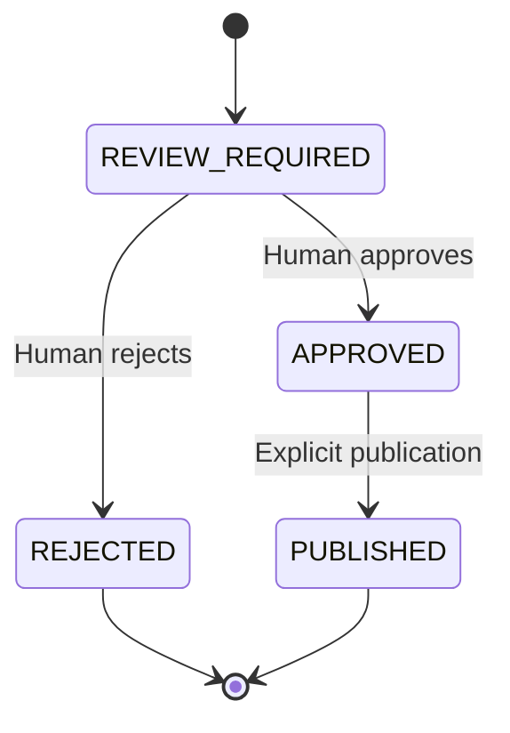

# Architecture

## Purpose

ReadinessOps is a Snowflake-native governance workspace that converts assessment context into reviewable AI proposals, accountable human decisions, and governed operational records.

The central design decision is the separation between:

```text
AI proposal authority
and
human governance authority
```

## End-to-End Flow



## Governance State Model



A proposal can become `PUBLISHED` only after a person has moved it to `APPROVED`.

## Responsibility Model

| Layer | Responsibility | Cannot do |
|---|---|---|
| Assessment context | Supplies Question, Answer, Evidence, and Rule Context | Approve or publish proposals |
| Cortex | Generates Gap, Risk, and Action drafts | Write governed records directly |
| Human review | Approves or rejects individual proposals | Bypass the publication procedure |
| Publication procedure | Writes approved proposals and records publication | Publish unresolved or rejected proposals |
| Presentation layer | Shows governed records and traceability | Treat drafts as published truth |

## Data Responsibilities

| Object | Responsibility |
|---|---|
| `ASSESSMENT_RUNS` | Assessment execution container |
| `READINESS_QUESTIONS` | Question and expected-evidence requirement |
| `ASSESSMENT_ANSWERS` | Effective answer for a Run and Question |
| `EVIDENCE_ITEMS` | Supplied supporting evidence |
| `GOVERNANCE_AGENT_RUN` | Review execution, model, instruction, status, timestamps, fingerprint, and summary |
| `GOVERNANCE_AGENT_PROPOSAL` | Gap, Risk, or Action draft and review state |
| `GOVERNANCE_AGENT_PROPOSAL_SOURCE` | Proposal-to-source traceability |
| `GOVERNANCE_APPROVAL_HISTORY` | Approval, rejection, and publication events |
| `READINESS_GAPS` | Governed Gap records and normalized Risk records |
| `RECOMMENDED_ACTIONS` | Governed Action records |
| `V_READINESSOPS_ACTION_BOARD` | Governed dashboard presentation |

## Procedures

### `SP_RUN_FULL_GOVERNANCE_REVIEW`

Inputs:

- Assessment Run ID
- Optional additional business instruction

Behavior:

1. Validates the Assessment Run
2. Creates a governance Agent Run
3. Builds the prompt from Question, Answer, Evidence, and Rule Context
4. Adds the optional business instruction without removing the standard grounding requirement
5. Calls Snowflake Cortex
6. Removes optional markdown fences and parses JSON defensively
7. Creates Gap, Risk, and Action proposals as `REVIEW_REQUIRED`
8. Normalizes priority values
9. Creates source-traceability rows
10. Marks the run `COMPLETED` or `FAILED`

### `SP_REVIEW_AGENT_PROPOSAL`

Inputs:

- Proposal ID
- `APPROVE` or `REJECT`
- Optional Decision comment

Behavior:

- Updates one proposal
- Records reviewer identity and timestamp
- Appends a decision event to `GOVERNANCE_APPROVAL_HISTORY`
- Does not publish a governed record

### `SP_PUBLISH_AGENT_RUN`

Input:

- Agent Run ID

Behavior:

- Freezes the approved proposals at the beginning of the call
- Publishes approved Gaps to `READINESS_GAPS`
- Publishes approved Risks to `READINESS_GAPS` with a `[RISK]` title prefix
- Publishes approved Actions to `RECOMMENDED_ACTIONS`
- Stores Source Proposal and Agent Run identifiers
- Updates proposal state to `PUBLISHED`
- Appends publication events
- Prevents duplicate canonical writes and duplicate publication history

## Canonical Risk Normalization

Risk is a first-class proposal type in:

- Cortex output
- `GOVERNANCE_AGENT_PROPOSAL`
- Human review
- Decision history
- Published-record classification in the app

The demonstration schema does not include a dedicated canonical Risk table. Therefore, approved Risks are normalized into `READINESS_GAPS` with:

```text
GAP_TITLE = '[RISK] ' || proposal title
SOURCE_PROPOSAL_ID = Risk proposal ID
SOURCE_AGENT_RUN_ID = Agent Run ID
```

The application recovers the published record type by joining the canonical row back to its source proposal. A future production model should introduce a dedicated Risk register when independent Risk ownership, treatment, acceptance, and residual-risk fields are required.

## Traceability

```text
Assessment Run
  → Question
  → Answer
  → Evidence Item
  → Requirement / Rule Context
  → Agent Run
  → Proposal
  → Human Decision
  → Published Record
```

## Presentation Layer

`V_READINESSOPS_ACTION_BOARD` is the governed presentation source. It excludes legacy `AR_%` records created by the earlier direct-write prototype.

The Streamlit app separately presents:

- Latest unresolved and reviewed proposals
- Governed records
- Decision and publication history
- Assessment context
- Agent Run metadata

## Audit Semantics

`GOVERNANCE_APPROVAL_HISTORY` is persistent application-recorded history. The current repository does not claim storage-level immutability. Production hardening should add role separation, restricted update/delete privileges, retention policy, monitoring, and independent audit export.

## Key Design Decisions

| Decision | Rationale |
|---|---|
| Separate proposals from governed tables | Prevents model output from silently becoming the system of record |
| Human decision per proposal | Supports selective approval and rejection |
| Separate approval and publication | Makes write authority explicit |
| Source row per proposal | Makes evidence grounding inspectable |
| Input fingerprint | Supports repeatability and run comparison |
| Priority normalization | Handles model output variation defensively |
| Issue-based UI | Avoids repeating evidence context for every proposal |
| One-based list numbering | Matches user expectations for review lists |
| Back-to-queue action | Prevents dead ends in an empty publication state |
| Canonical dashboard filter | Keeps the legacy direct-write prototype outside governed results |

## Snowflake Features

- `SNOWFLAKE.CORTEX.COMPLETE()` for inference
- SQL stored procedures for governed workflows
- `VARIANT`, `FLATTEN`, and `TRY_PARSE_JSON`
- Streamlit in Snowflake for human review
- Views for presentation
- Snowflake identity and timestamps for attribution
