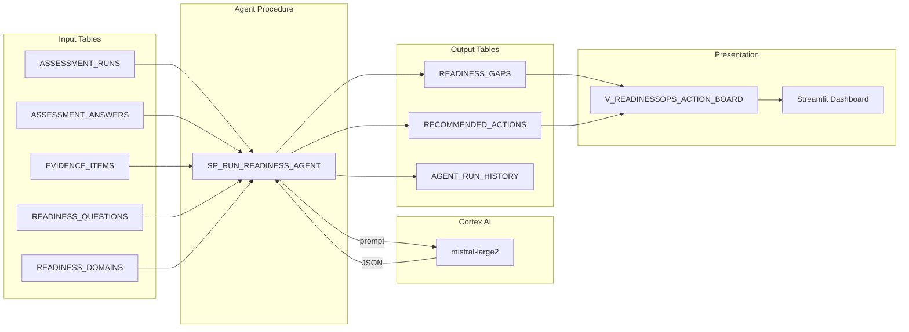
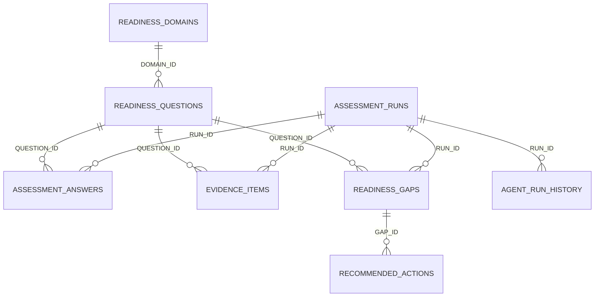

# Architecture

## System Overview

ReadinessOps is an AI-powered assessment agent that evaluates organizational readiness
for AI adoption. It reads structured assessment data, calls Snowflake Cortex AI to
identify gaps, and writes prioritized remediation actions back to the database.

## Data Flow

## Agent Pipeline Steps

| Step | Name | What Happens |
|:---:|------|--------------|
| 1 | LOAD_ASSESSMENT | Read answers + evidence for the target run |
| 2 | VALIDATE_EVIDENCE | Construct prompt with all assessment context |
| 3 | DETECT_GAPS | Call Cortex AI, strip fences, validate JSON |
| 4 | GENERATE_ACTIONS | Parse gaps + actions, write to tables |

## Key Design Decisions

| Decision | Rationale |
|----------|-----------|
| Single stored procedure | Smallest deployable unit; no external dependencies |
| Transaction wrapping | Atomic success/failure; DELETEs roll back with INSERTs |
| AR_ prefix on IDs | Cleanly separates AI output from seed data |
| TRY_PARSE_JSON | Graceful failure instead of unhandled exception |
| REGEXP_REPLACE for fences | LLMs frequently ignore "no markdown" instructions |
| TRY_CAST via VARCHAR | Snowflake's TRY_CAST rejects VARIANT directly |
| INNER JOIN for actions | Prevents orphan rows with NULL GAP_ID |
| Millisecond timestamp IDs | Avoids collisions without UUID overhead |

## Table Relationships

## Snowflake Features Used

- **Cortex AI** — `SNOWFLAKE.CORTEX.COMPLETE()` for LLM inference
- **SQL Scripting** — Stored procedure with variables, transactions, exception handling
- **Semi-structured data** — VARIANT, FLATTEN, TRY_PARSE_JSON for JSON processing
- **Views** — Denormalized action board for presentation layer
- **Streamlit in Snowflake** — Interactive dashboard with agent trigger button
