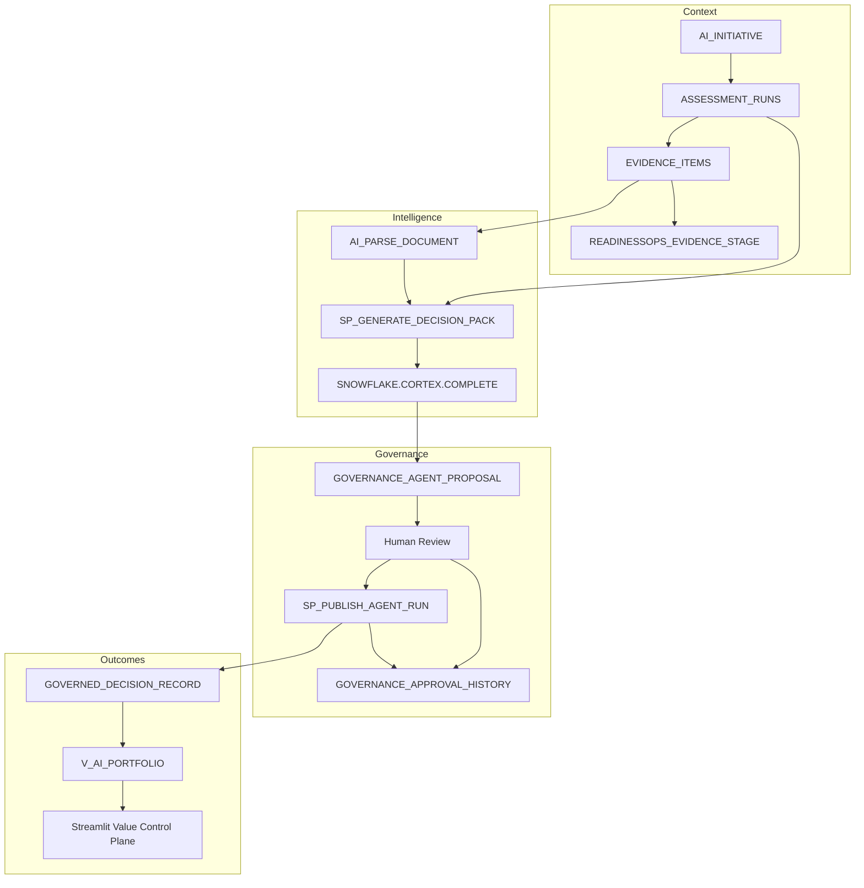
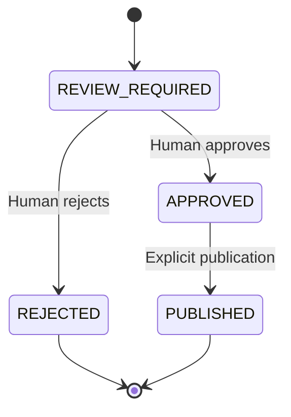

# Architecture

## Purpose

ReadinessOps is a Snowflake-native governance workspace that converts initiative context and evidence into reviewable AI proposals, accountable human decisions, governed records, and a portfolio view.

The central boundary is unchanged across both supported workflows:

```text
AI proposes; a person decides; explicit publication creates the governed record.
```

## Finalist Value Control Plane Flow



## Governance State Model



Generation never writes to `GOVERNED_DECISION_RECORD`. A proposal can become `PUBLISHED` only after a person moves it to `APPROVED` and confirms publication.

## Responsibility Model

| Layer | Responsibility | Cannot do |
|---|---|---|
| Initiative and assessment | Define ownership, stage, answers, and expected evidence | Approve or publish proposals |
| Evidence intake | Validate content, retain original files, parse PDFs, and store metadata | Convert evidence directly into a governed decision |
| Cortex AI | Generate the four-section Decision Pack or legacy Gap/Risk/Action drafts | Approve or publish its output |
| Human review | Inspect, edit, approve, or reject each proposal | Bypass publication controls |
| Publication procedure | Publish approved proposals idempotently and append history | Publish unresolved or rejected proposals |
| Presentation layer | Show drafts, published records, portfolio state, and history | Treat drafts as published truth |

## Data Responsibilities

| Object | Responsibility |
|---|---|
| `AI_INITIATIVE` | Initiative identity, owner, stage, and status |
| `ASSESSMENT_RUNS` | Assessment execution and initiative link |
| `EVIDENCE_ITEMS` | Extracted text, validation state, hash, source metadata, parser metadata, and stage path |
| `READINESSOPS_EVIDENCE_STAGE` | Original TXT and PDF evidence retention |
| `GOVERNANCE_AGENT_RUN` | Generation execution, model, instruction, status, timestamps, and summary |
| `GOVERNANCE_AGENT_PROPOSAL` | Legacy or Decision Pack draft and lifecycle state |
| `GOVERNANCE_AGENT_PROPOSAL_SOURCE` | Proposal-to-evidence source links |
| `GOVERNANCE_APPROVAL_HISTORY` | Approval, rejection, and publication events |
| `GOVERNED_DECISION_RECORD` | Published Governance, Value, Model Routing, and Portfolio decisions |
| `V_AI_PORTFOLIO` | Initiative-level governance and value presentation |
| `READINESS_GAPS` | Published legacy Gap records and normalized Risk records |
| `RECOMMENDED_ACTIONS` | Published legacy Action records |

## Evidence Intake

TXT and PDF uploads use the same controlled pattern:

1. Validate the uploaded file and compute SHA-256.
2. Detect duplicate evidence within the Assessment Run.
3. Retain the original file under a Run- and Evidence-specific stage path.
4. Decode TXT locally or parse PDF with `AI_PARSE_DOCUMENT`.
5. Store extracted text, counts, parser metadata, uploader, timestamp, hash, and stage path in `EVIDENCE_ITEMS`.
6. Mark only successfully stored and parsed content as `VALIDATED`.

This preserves both the machine-readable evidence text and the original source artifact.

## Decision Pack Procedure

### `SP_GENERATE_DECISION_PACK`

Inputs:

- Assessment Run ID
- Optional additional instruction

Behavior:

1. Validates the Assessment Run, linked initiative, and available evidence.
2. Creates a Decision Pack Agent Run.
3. Builds a prompt from assessment and uploaded evidence.
4. Calls `SNOWFLAKE.CORTEX.COMPLETE('mistral-large2', ...)`.
5. Removes optional markdown fences and parses JSON defensively.
6. Requires exactly four objects: `governance_summary`, `value_realization`, `model_routing`, and `portfolio_recommendation`.
7. Validates required fields, priority as an integer from 1 through 100, and non-empty source evidence IDs.
8. Confirms every cited evidence ID belongs to the selected Assessment Run.
9. Creates four `REVIEW_REQUIRED` proposals and per-section source links.
10. Marks the run `COMPLETED` or records a controlled failure.

### `SP_EDIT_AGENT_PROPOSAL`

Allows a reviewer to edit one draft before deciding. Editing does not approve or publish it.

### `SP_PUBLISH_AGENT_RUN`

The existing publication procedure is extended additively:

- Gap → `READINESS_GAPS`
- Risk → `READINESS_GAPS` with `[RISK]` prefix
- Action → `RECOMMENDED_ACTIONS`
- `DECISION_*` → `GOVERNED_DECISION_RECORD`

For every type it publishes only `APPROVED` proposals, sets the published entity identifier, updates proposal state, appends a `PUBLISH` event, and prevents duplicate writes.

## Traceability

```text
AI Initiative
→ Assessment Run
→ Evidence Item
→ Original Stage File
→ Agent Run
→ Decision Pack Proposal
→ Human Decision
→ Governed Decision Record
→ Portfolio View
```

Every published Decision Pack section retains source proposal, agent run, assessment run, initiative, evidence links, actor, and timestamp.

## Compatibility with Existing Governance

The finalist migration does not replace the existing Question/Answer governance path. Existing Gap, Risk, and Action generation, review, canonical mapping, and audit behavior remain available. Decision Pack proposal types occupy a separate namespace (`DECISION_*`) and publish to a separate governed table.

## Key Design Decisions

| Decision | Rationale |
|---|---|
| Preserve original evidence files | Supports inspection, replay, and provenance beyond extracted text |
| Strict four-section contract | Prevents partial or structurally ambiguous Decision Packs |
| Evidence-ID validation | Prevents invented or cross-run citations |
| Separate proposals and records | Prevents model output from becoming the system of record |
| Human decision per section | Allows selective approval, rejection, and editing |
| Separate approval and publication | Makes write authority explicit |
| Additive publication extension | Protects the validated legacy Gap/Risk/Action behavior |
| Isolated E2E Run | Verifies the finalist path without modifying `RUN_001` |

## Snowflake Features

- Snowflake Cortex `COMPLETE` for structured Decision Pack generation
- Cortex `AI_PARSE_DOCUMENT` for PDF extraction
- Streamlit in Snowflake for evidence intake and human governance
- SQL stored procedures for validation and controlled state transitions
- `VARIANT`, `FLATTEN`, `TRY_PARSE_JSON`, and `OBJECT_KEYS`
- Internal stages for original-file retention
- Views for portfolio presentation
- Snowflake identity and timestamps for attribution

## Production Hardening

The demonstration uses synthetic data. Production deployment should add role separation, least-privilege grants, stage and row-access policies, retention rules, monitoring, independent audit export, tenant isolation, and controlled model/version configuration.
