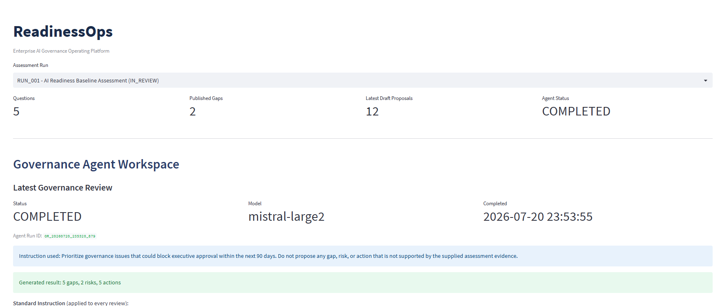
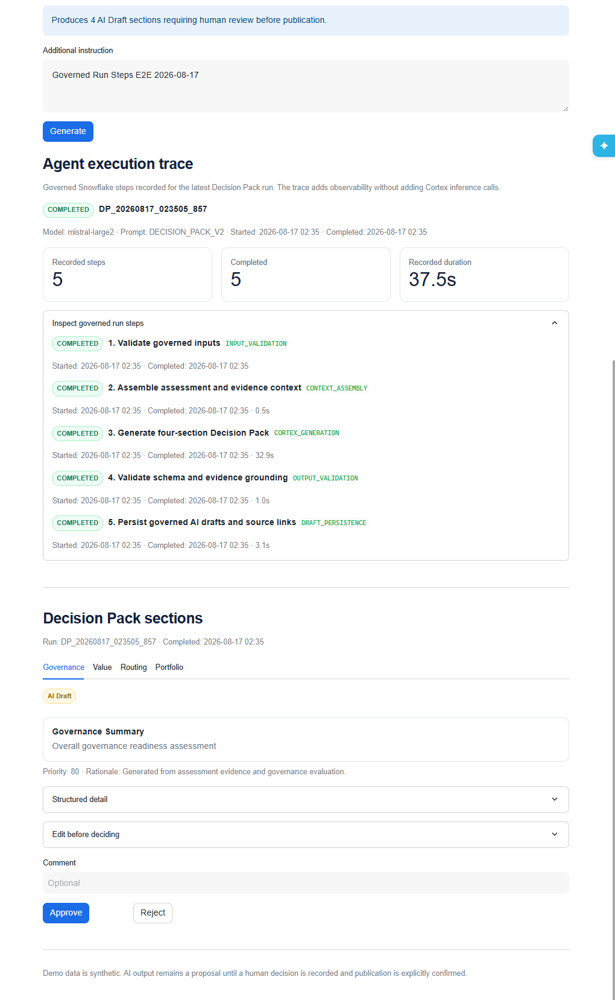
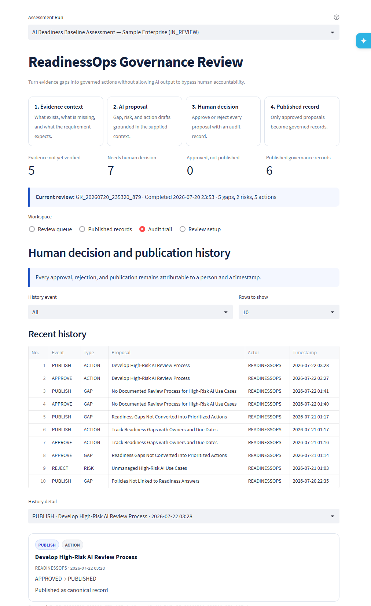

# Hackathon Submission

## Project

**SOLIFAN ReadinessOps — Human-Governed AI Readiness Management on Snowflake**

## One-Sentence Description

A Snowflake-native governance workspace that uses Cortex AI to create evidence-grounded Gap, Risk, and Action drafts, requires an accountable human decision, and publishes only approved proposals as governed records with traceable history.

## Problem

A readiness score does not operate governance. Organizations must continuously connect:

```text
Question → Answer → Evidence → Gap → Risk → Action → Decision
```

A direct-write AI agent is unsafe because generated text can become the system of record without accountable review, publication authority, or a preserved basis for the decision.

## Solution

ReadinessOps separates analysis from authority:

1. Read Assessment Run answers, evidence, and Requirement / Rule Context
2. Accept an optional natural-language business priority
3. Generate Gap, Risk, and Action drafts with Snowflake Cortex
4. Store every proposal as `REVIEW_REQUIRED`
5. Show the source context and AI rationale to the reviewer
6. Approve or reject one proposal at a time
7. Publish only approved proposals through a separate procedure
8. Preserve decision and publication history
9. Present governed records separately from unresolved drafts

## Application Screenshots

### Governance Review Summary



### Natural-Language AI Review Setup



### Human Decision and Publication Audit



## Evaluation Criteria Mapping

### Technical Implementation — 40%

| Aspect | Implementation |
|---|---|
| Snowflake-native workflow | Data, inference, procedures, Streamlit, and history remain in Snowflake |
| Cortex integration | `SNOWFLAKE.CORTEX.COMPLETE('mistral-large2', ...)` |
| Structured output | JSON arrays for `gaps`, `risks`, and `actions` |
| Defensive parsing | Fence stripping, `TRY_PARSE_JSON`, safe casts, and priority normalization |
| Proposal isolation | Every AI result begins as `REVIEW_REQUIRED` |
| Human decision | `SP_REVIEW_AGENT_PROPOSAL` with actor, time, state, and comment |
| Controlled publication | `SP_PUBLISH_AGENT_RUN` publishes only approved proposals |
| Traceability | Proposal source rows connect to Question, Answer, Evidence, Rule Context, and Agent Run |
| Idempotency | Duplicate governed writes and duplicate publication history are prevented |
| Runtime compatibility | Tested Streamlit fallbacks, native boolean parameters, and one-based tables |
| Read-only final validation | Procedure, traceability, state, audit, duplicate, and production-object checks |

### Real-World Relevance — 30%

- **Users:** CCoE teams, AI governance leads, risk managers, program owners, internal audit, and executive sponsors
- **Decision boundary:** AI proposes; accountable people decide
- **Operational value:** Assessment history supports repeated governance reviews rather than a one-time report
- **Evidence value:** Every proposal is inspectable before approval
- **Integration value:** Published Snowflake records can feed BI, Cortex, reporting, and downstream agents
- **Governance value:** Approval and publication are distinct authorities
- **Adaptability:** The lifecycle can be repeated across domains and Assessment Runs

### Completeness — 30%

| Component | Status |
|---|---|
| Assessment context | Complete for the demonstration model |
| Natural-language priority input | Complete |
| Governance Agent Run | Complete |
| Gap, Risk, and Action drafts | Complete |
| Proposal-source traceability | Complete |
| Human approval and rejection | Complete |
| Controlled publication | Complete |
| Decision and publication history | Complete |
| Governed-record workspace | Complete |
| Issue-based review UX | Complete |
| Production deployment and rollback scripts | Complete |
| Read-only final validation | Complete |
| Documentation and four-minute demo | Complete |

## Technical Control Boundary

```text
Requirement / Rule Context
        ↓
AI Proposed
        ↓
Human Approved
        ↓
Explicitly Published
```

The AI cannot approve its own proposal and cannot invoke publication through the UI without a human-approved state.

## Verified Results

A completed review generated:

| Proposal type | Count |
|---|---:|
| Gap | 5 |
| Risk | 2 |
| Action | 5 |
| Total drafts | 12 |

Verified lifecycle behavior:

| Test | Result |
|---|---|
| Gap approval and publication | Passed |
| Risk rejection without publication | Passed |
| Action approval and publication | Passed |
| Separate approval and publication events | Passed |
| Duplicate publication prevention | Passed |
| Source Proposal and Agent Run traceability | Passed |
| One-based visible list numbering | Passed |
| Empty publication-state navigation | Passed |
| Production dashboard deployment | Passed |
| Git `main` synchronization | Passed |

## Canonical Risk Constraint

Risk is reviewed as a first-class proposal. Because the demonstration schema has no dedicated Risk table, an approved Risk is published to `READINESS_GAPS` with a `[RISK]` prefix and remains identifiable through its source proposal. This limitation is explicit in the Architecture and README.

## Built With CoCo CLI

The implementation workflow included:

1. Live Snowflake schema inspection
2. SQL procedure development
3. Cortex output testing
4. Runtime failure diagnosis
5. Read-only validation
6. Streamlit deployment
7. End-to-end governance testing
8. Git and documentation synchronization

## Why It Matters

ReadinessOps demonstrates that AI governance should not stop at diagnosis and should not allow generated output to silently become truth. It operationalizes the accountable path from evidence to action while keeping publication authority with people.

## Relationship to SOLIFAN CCoE Readiness Studio

ReadinessOps is the governed-agent workflow for the broader SOLIFAN CCoE Readiness Studio concept: an Enterprise AI Governance operating platform that tracks readiness over time and connects evidence, gaps, risks, decisions, and actions.
